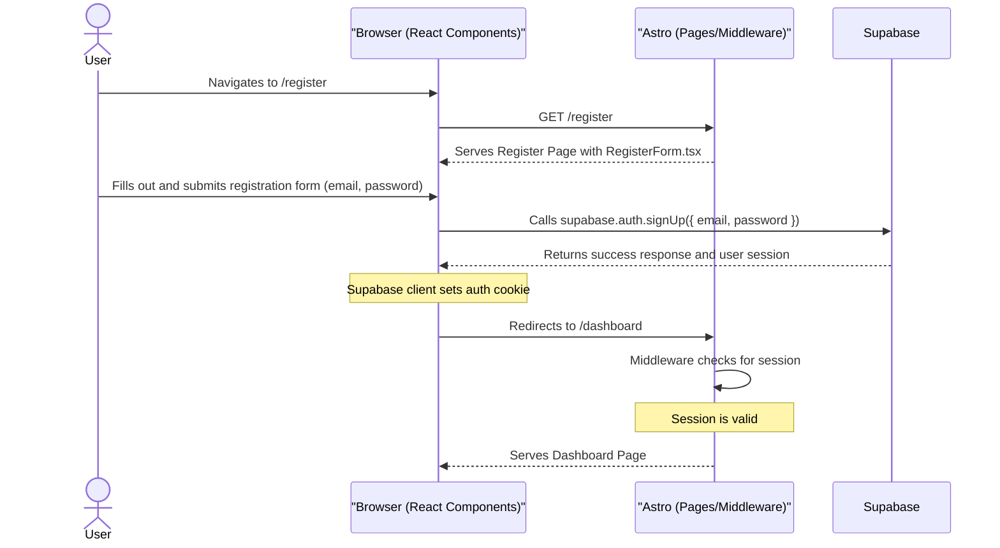
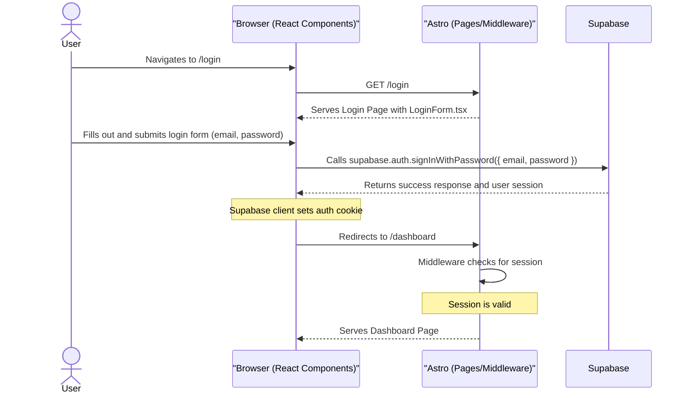
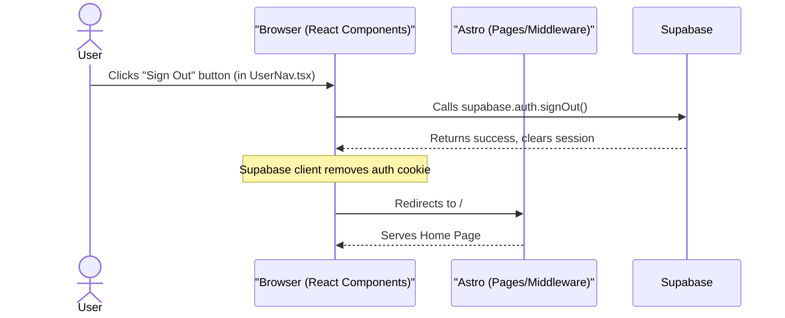
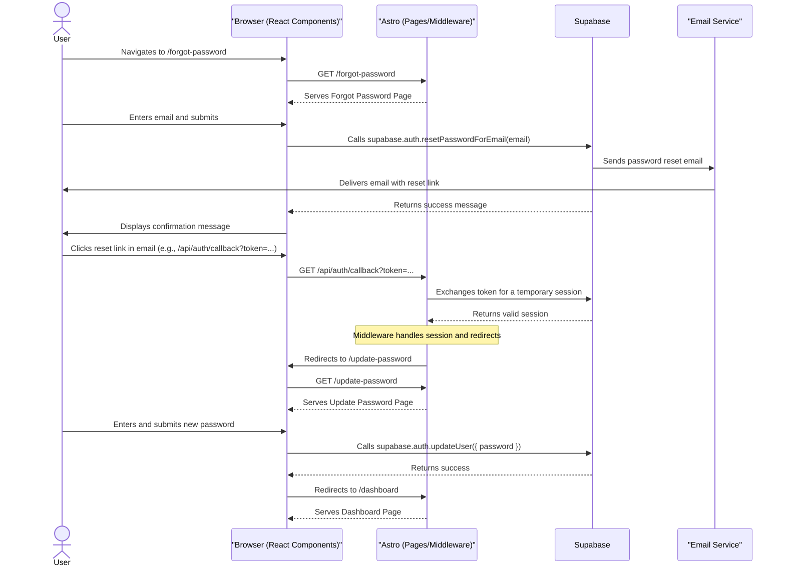

# Authentication Flow Diagrams

This document contains Mermaid.js sequence diagrams illustrating the authentication flows for the 10xCards application, based on the technical specifications.

## 1. User Registration Flow

## 2. User Login Flow

## 3. User Logout Flow

## 4. Password Reset Flow

